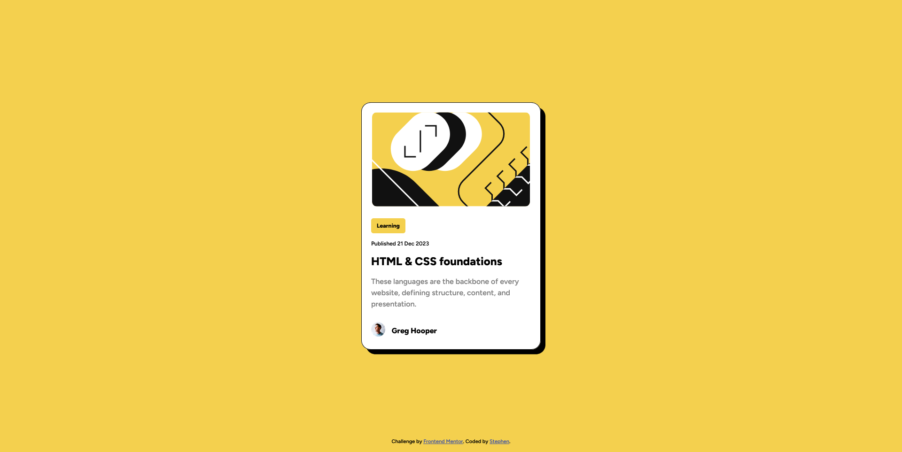

# Frontend Mentor - Blog preview card solution

This is a solution to the [Blog preview card challenge on Frontend Mentor](https://www.frontendmentor.io/challenges/blog-preview-card-ckPaj01IcS). Frontend Mentor challenges help you improve your coding skills by building realistic projects. 

## Table of contents

- [Overview](#overview)
  - [The challenge](#the-challenge)
  - [Screenshot](#screenshot)
  - [Links](#links)
- [My process](#my-process)
  - [Built with](#built-with)
  - [Continued development](#continued-development)
- [Author](#author)
- [Acknowledgments](#acknowledgments)

## Overview

### The challenge

Users should be able to:

- See hover and focus states for all interactive elements on the page
- Change browser dimension without breaking the layout

### Screenshot

### Links

- Solution URL: [Solution URL](https://github.com/Argetlahm/blog-preview-card-component)
- Live Site URL: [Live site](https://argetlahm.github.io/blog-preview-card-component/)

## My process

### Built with

- Semantic HTML5 markup
- CSS custom properties
- Flexbox
- Mobile-first workflow

### Continued development

Optimizing and bug fixes if needed

**Note: Delete this note and replace the list above with resources that helped you during the challenge. These could come in handy for anyone viewing your solution or for yourself when you look back on this project in the future.**

## Author

- Github - [Stephen](https://github.com/Argetlahm)
- Frontend Mentor - [@Argetlahm](https://www.frontendmentor.io/profile/Argetlahm)

## Acknowledgments

Thanks for Frontend Mentor for creating these challenges to help me practice with my frontend development skills.
